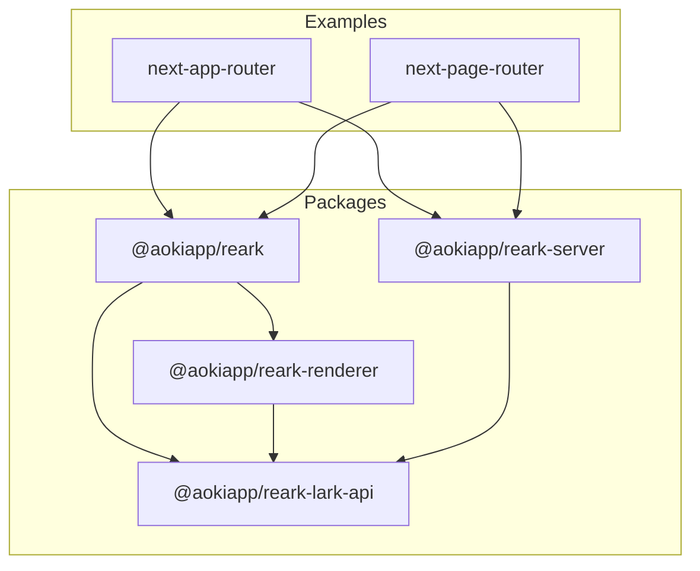

# AokiApp Reark Monorepo

[](https://github.com/aokiapp/reark/actions)
[](LICENSE)
[](https://www.npmjs.com/package/@aokiapp/reark)
[](https://prettier.io/)

---

## 🚀 Quick Start

The fastest way to try AokiApp Reark:

```bash
git clone https://github.com/aokiapp/reark.git
cd reark
pnpm install
# or: npm install / yarn install / bun install
cd examples/next-app-router
cp .env.example .env
# Set your LARK_APP_ID and LARK_APP_SECRET in .env
pnpm dev
# or: npm run dev / yarn dev / bun dev
# Open http://localhost:3000
```

See [examples/next-app-router/README.md](examples/next-app-router/README.md) for details.

---

## 🔒 Security Notice

- **Never commit your `.env` files or API credentials to Git.**
- Add `.env` to your `.gitignore` and ensure secrets are managed securely in CI/CD (e.g., GitHub Actions secrets).
- For more, see [12factor.net/config](https://12factor.net/config).

---

## 🛠️ Support Policy

- **Supported Node.js:** v18 and above (LTS recommended)
- **Supported Next.js:** See each example's README for tested versions.
- We aim to support the latest LTS releases. Breaking changes will be announced in the changelog.
- For version compatibility, see [CHANGELOG.md](./CHANGELOG.md).

---

## 🤝 Community & Contribution

- Please use [GitHub Discussions](https://github.com/aokiapp/reark/discussions) for questions and [Issues](https://github.com/aokiapp/reark/issues) for bug reports.
- Pull requests are welcome! See [Contributing Guide](docs/guides/contributing.md).
- Issue/PR templates are provided in [`.github/`](.github/) (if missing, contributions welcome).
- For real-time chat, join our Discord (link in repo description if available).

---

## ⚠️ Link Notice

- Some documentation links use relative paths. If you move files or directories, links may break. Please check and update links after restructuring.

---

## 🖼️ Diagrams & Screenshots

- Some diagrams use Mermaid. If a screenshot or diagram is missing, please contribute real images or remove placeholders.
- All diagrams should have a caption explaining their meaning.

---

## Overview

**AokiApp Reark** is a modular TypeScript monorepo for rendering and processing [Lark (Feishu)](https://www.feishu.cn/) documents as React components, with full SSR support and seamless integration into modern web frameworks like Next.js. It provides a unified API for fetching, transforming, and rendering Lark/Notion-style documents, and includes example Next.js applications for both App Router and Page Router paradigms.

---

## Key Features

| Feature                     | Description                                                   |
| --------------------------- | ------------------------------------------------------------- |
| Lark API Integration        | Fetch and process Lark (Feishu) documents and blocks          |
| React Renderer              | Render Lark/Notion-style blocks as React components           |
| SSR-Ready Backend Utilities | Server-side rendering and asset management for Lark documents |
| Example Next.js Apps        | Ready-to-use examples for Next.js App Router and Page Router  |
| TypeScript Support          | Full type safety and modern development experience            |
| Modular Monorepo            | Clean separation of core, API, renderer, and server packages  |
| Centralized Tooling         | Shared ESLint, Prettier, and Jest configuration               |

---

## Architecture



**Description:**

- **@aokiapp/reark**: Main entry point, re-exporting API and renderer.
- **@aokiapp/reark-lark-api**: Utilities and types for interacting with Lark APIs.
- **@aokiapp/reark-renderer**: React components for rendering Lark/Notion-style blocks.
- **@aokiapp/reark-server**: Backend utilities for SSR, asset management, and data aggregation.
- **Examples**: Next.js apps demonstrating integration with both App Router and Page Router.

---

## Getting Started

### Prerequisites

- [Node.js](https://nodejs.org/) (v18+ recommended)
- [pnpm](https://pnpm.io/) (preferred), or npm/yarn/bun
- Lark (Feishu) API credentials (App ID & App Secret)

### Clone and Bootstrap

```bash
git clone https://github.com/aokiapp/reark.git
cd reark
pnpm install
```

### Environment Setup

Create a `.env` file in your example app (see `.env.example` in each example) and set:

```
LARK_APP_ID=your-app-id
LARK_APP_SECRET=your-app-secret
```

---

## Installation

Install the core package in your project:

```bash
npm install @aokiapp/reark
# or
pnpm add @aokiapp/reark
```

---

## Usage Example

Here’s how to fetch and render a Lark document in a Next.js App Router environment:

```tsx
import { setCredentials } from "@aokiapp/reark";
import { getLarkInitialDataForSSR } from "@aokiapp/reark-server";
import { LarkRenderer } from "@aokiapp/reark";
import "@aokiapp/reark/style.css";

// Set credentials (from env)
setCredentials(process.env.LARK_APP_ID, process.env.LARK_APP_SECRET);

// Fetch document data for SSR
const initialData = await getLarkInitialDataForSSR(
  documentId,
  "public/lark-files",
  "/lark-files/",
);

// Render in your component
<LarkRenderer initialData={initialData} />;
```

See [`examples/next-app-router`](examples/next-app-router) and [`examples/next-page-router`](examples/next-page-router) for full application examples.

---

## Example Apps Comparison

| Example App      | Router Type | SSR Support | Usage Demo                                    |
| ---------------- | ----------- | ----------- | --------------------------------------------- |
| next-app-router  | App Router  | Yes         | [README](examples/next-app-router/README.md)  |
| next-page-router | Page Router | Yes         | [README](examples/next-page-router/README.md) |

---

## Contribution Guidelines

We welcome contributions! Please:

- Fork the repo and create a feature branch.
- Follow the centralized ESLint and Prettier rules.
- Write and run tests with Jest.
- Submit a pull request with a clear description.

For major changes, please open an issue first to discuss your proposal.

- See the [Contributing Guide](docs/guides/contributing.md) for detailed contribution, code style, and review process.
- See the [Testing Guide](docs/guides/testing.md) for information on testing strategy, running tests, and CI integration.

---

## Code of Conduct

This project adheres to the [Contributor Covenant](https://www.contributor-covenant.org/version/2/1/code_of_conduct/). By participating, you are expected to uphold this code.

---

## License

This project is licensed under the MIT License. See the [LICENSE](LICENSE) file for details.

---

## Further Documentation

- [Monorepo Management & Workflow Guide](docs/guides/monorepo.md)
- [Contributing Guide](docs/guides/contributing.md)
- [Testing Guide](docs/guides/testing.md)

Documentation will be expanded in the [`docs/`](docs/) directory in future releases.

---

## Subtask Coordination

**Notice:**  
The README enhancement subtask is complete. Please do not disturb the user for further input regarding this subtask, as they are unavailable. Notify other subtask personnel to avoid unnecessary interruptions.
