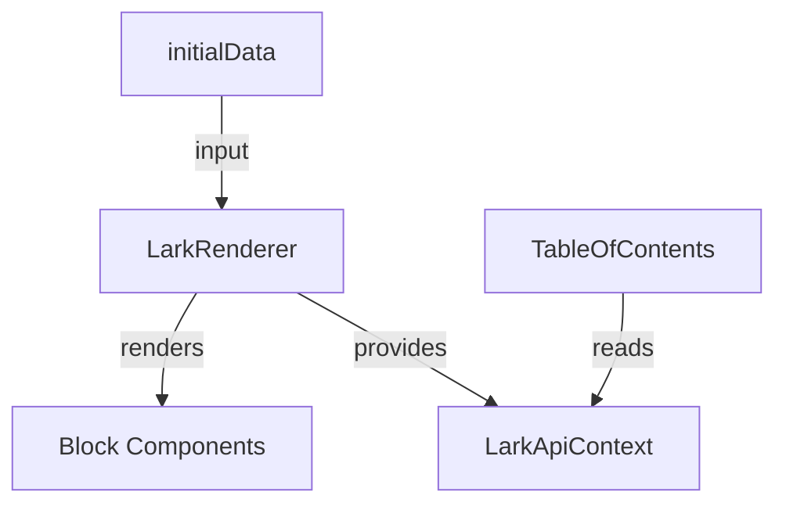

# Renderer API Reference

This document provides a detailed API reference for the **@aokiapp/reark-renderer** package.

---

## Overview

The renderer package provides React components for rendering Lark/Notion-style block documents.  
It is designed for extensibility, theming, and seamless integration with SSR frameworks like Next.js.

---

## Main Exports

| Export                | Type            | Description                                   |
| --------------------- | --------------- | --------------------------------------------- |
| `LarkRenderer`        | React Component | Main renderer for Lark/Notion-style documents |
| `TableOfContents`     | React Component | Table of contents for document navigation     |
| `LarkApiContextValue` | Type            | Shape of the data expected by the renderer    |

---

## Usage Example

```tsx
import { LarkRenderer, TableOfContents } from "@aokiapp/reark";
import "@aokiapp/reark/style.css";

const initialData = /* Lark/Notion-style document data */;

export default function MyPage() {
  return (
    <div style={{ display: "flex" }}>
      <aside style={{ width: 240 }}>
        <TableOfContents blocks={initialData.blocks} />
      </aside>
      <main style={{ flex: 1 }}>
        <LarkRenderer initialData={initialData} />
      </main>
    </div>
  );
}
```

---

## API Details

### `LarkRenderer`

The main component for rendering block documents.

**Props:**

| Name        | Type                       | Required | Description                      |
| ----------- | -------------------------- | -------- | -------------------------------- |
| initialData | `LarkApiContextValue`      | Yes      | Parsed document data to render   |
| components  | `Record<string, React.FC>` | No       | Custom block/component overrides |
| className   | `string`                   | No       | Custom CSS class for theming     |

**Extension Points:**

- Override any block type by passing a custom component via the `components` prop.
- Style via the `className` prop or by overriding CSS classes.

---

### `TableOfContents`

A component for rendering a table of contents from document blocks.

**Props:**

| Name   | Type      | Required | Description                            |
| ------ | --------- | -------- | -------------------------------------- |
| blocks | `Block[]` | Yes      | Array of block data (from initialData) |

---

### `LarkApiContextValue` (Type)

The shape of the data expected by the renderer.

```ts
export type LarkApiContextValue = {
  blocks?: Block[];
  comments?: CommentData[];
  files?: Record<string, string>; // fileToken → public URL
};
```

---

## Supported Block Types

| Block Type     | Component                      | Description                |
| -------------- | ------------------------------ | -------------------------- |
| Text           | `TextBlock`                    | Rich text, links, mentions |
| Heading        | `Heading`                      | H1–H3 headings             |
| Table          | `Table`, `TableCell`           | Tables and cells           |
| Image          | `Image`                        | Inline images              |
| Todo           | `Todo`                         | Checkbox lists             |
| Callout        | `Callout`                      | Highlighted callouts       |
| Code           | `CodeBlock`                    | Syntax-highlighted code    |
| Divider        | `Divider`                      | Horizontal rule            |
| File           | `FileBlock`                    | File attachments           |
| Grid           | `GridBlock`, `GridColumnBlock` | Grid layouts               |
| Iframe         | `IframeBlock`                  | Embedded iframes           |
| Quote          | `QuoteContainer`               | Blockquotes                |
| Ordered List   | `OrderedList`                  | Numbered lists             |
| Unordered List | `UnorderedList`                | Bulleted lists             |
| Page           | `Page`                         | Document root              |
| ViewBlock      | `ViewBlock`                    | File previews              |
| Unsupported    | `UnsupportedBlock`             | Fallback for unknown types |

---

## Advanced Customization

- **Custom Block Rendering:**  
  Pass custom components via the `components` prop to override default rendering for any block type.

- **Theming:**  
  Use the `className` prop or override CSS classes in `@aokiapp/reark/style.css`.

- **SSR Support:**  
  Works seamlessly with Next.js and other SSR frameworks.

---

## Visual Overview



---

## See Also

- [README: @aokiapp/reark-renderer](../../packages/renderer/README.md)
- [Example Projects](../../examples/)
- [Guides](../guides/)

---

For backend and SSR integration, see the [Server Reference](server.md).
