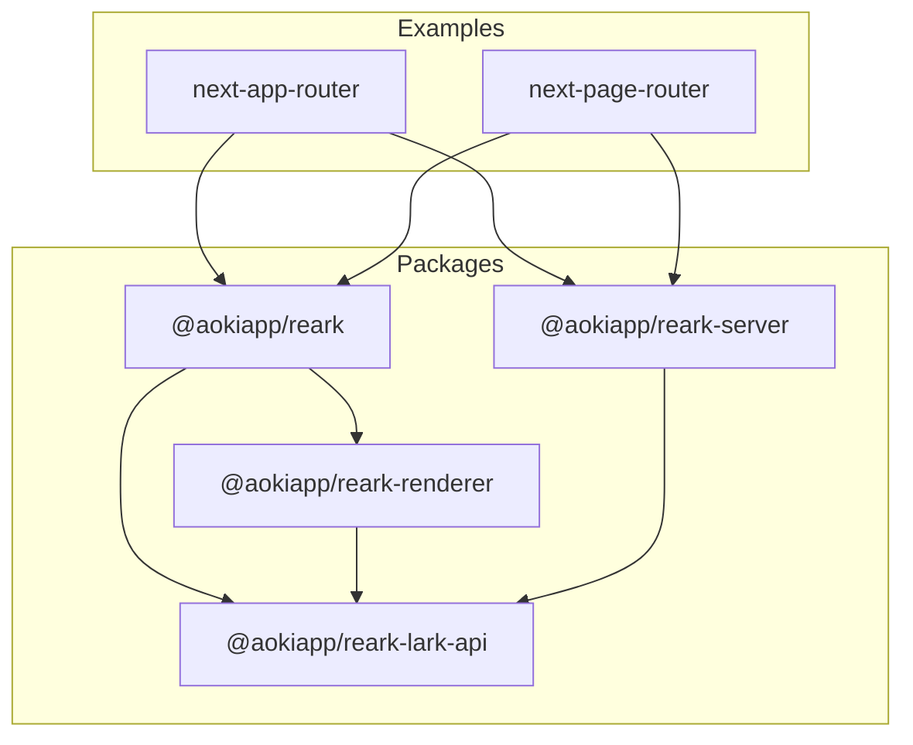

# Architecture Overview

AokiApp Reark is a modular TypeScript monorepo designed for rendering and processing Lark (Feishu) documents as React components, with full SSR support and seamless integration into modern web frameworks like Next.js.

## High-Level Architecture

## Package Relationships

- **@aokiapp/reark (Core):** Main entry point, re-exporting API and renderer.
- **@aokiapp/reark-lark-api:** Utilities and types for interacting with Lark APIs.
- **@aokiapp/reark-renderer:** React components for rendering Lark/Notion-style blocks.
- **@aokiapp/reark-server:** Backend utilities for SSR, asset management, and data aggregation.
- **Examples:** Next.js apps demonstrating integration with both App Router and Page Router.

## Data Flow

1. **Lark API Integration:** The lark-api package fetches and processes Lark document data.
2. **Core Logic:** The core package provides shared logic and re-exports key APIs.
3. **Rendering:** The renderer package transforms Lark/Notion-style blocks into React components.
4. **Server-Side Rendering:** The server package enables SSR and asset management for seamless integration with web frameworks.
5. **Example Apps:** Demonstrate real-world usage and integration patterns.

## Modular Monorepo Structure

Each package is independently versioned and can be used standalone or together. Shared tooling (ESLint, Prettier, Jest) ensures consistency across the codebase.

---

For more details, see the [API Reference](api/) and [Guides](guides/).
