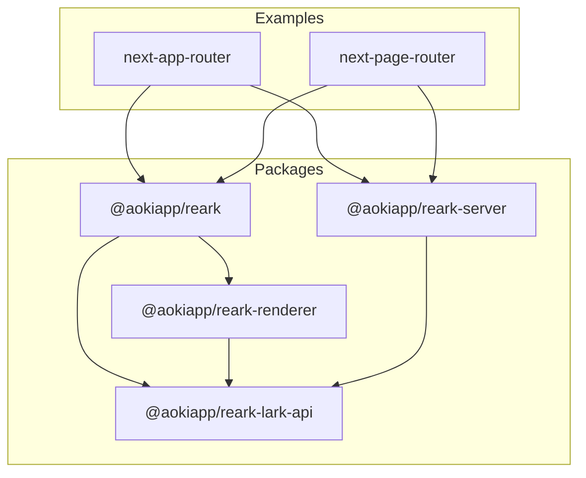

# Monorepo Management & Development Workflow Guide

Welcome to the AokiApp Reark monorepo! This guide provides a comprehensive overview of the monorepo structure, workspace management, build system, development workflow, and best practices for contributing to and maintaining the project.

---

## 1. Introduction

AokiApp Reark is organized as a modular TypeScript monorepo, enabling seamless development, testing, and deployment of related packages and example applications. This guide explains how the monorepo is structured, how to work efficiently within it, and how to follow best practices for high-quality contributions.

---

## 2. Monorepo Structure

The repository is organized as follows:

```
/
├── packages/         # Core libraries and modules
│   ├── core/         # Main entry point, re-exports API and renderer
│   ├── lark-api/     # Lark API utilities and types
│   ├── renderer/     # React components for rendering blocks
│   └── server/       # Backend utilities for SSR and asset management
├── examples/         # Example Next.js applications
│   ├── next-app-router/
│   └── next-page-router/
├── docs/             # Documentation portal
│   └── guides/
├── turbo.json        # Turborepo build system configuration
├── package.json      # Root workspace configuration
└── ...
```

### Package Relationships



- **@aokiapp/reark**: Main entry point, re-exporting API and renderer.
- **@aokiapp/reark-lark-api**: Utilities and types for interacting with Lark APIs.
- **@aokiapp/reark-renderer**: React components for rendering Lark/Notion-style blocks.
- **@aokiapp/reark-server**: Backend utilities for SSR, asset management, and data aggregation.
- **Examples**: Next.js apps demonstrating integration with both App Router and Page Router.

---

## 3. Workspace Management

### Workspaces

- Managed using **npm workspaces** (see `package.json`):
  ```json
  "workspaces": [
    "packages/*",
    "examples/*"
  ]
  ```
- All packages and examples are first-class workspaces. Dependencies between them are managed via standard npm mechanisms.

### Adding/Removing Packages

- To add a new package or example:
  1. Create a new directory under `packages/` or `examples/`.
  2. Add a `package.json` with a unique name (e.g., `@aokiapp/reark-<name>`).
  3. Run `npm install` at the root to register the new workspace.
- To remove, delete the directory and update any dependencies.

### Dependency Management

- Internal dependencies use workspace protocol (e.g., `"@aokiapp/reark-core": "workspace:*"`).
- External dependencies are managed as usual via npm.
- Keep dependencies up to date and avoid unnecessary duplication.

---

## 4. Build System: Turborepo

The monorepo uses [Turborepo](https://turbo.build/) for orchestrating builds, tests, linting, and development servers.

### turbo.json Overview

- **Tasks**: `lint`, `typecheck`, `test`, `build`, `build:watch`, `dev`
- **Caching**: Most tasks are cached for fast, incremental builds.
- **Dependency Graph**: Tasks can depend on outputs of other packages (e.g., `build` depends on upstream builds).
- **Persistent Tasks**: `dev` and `build:watch` run as persistent processes for development.

### Common Commands

- `npm run lint` — Lint all packages/examples
- `npm run typecheck` — Type-check all workspaces
- `npm run test` — Run all tests
- `npm run build` — Build all packages/examples
- `npm run dev` — Start dev servers (where supported)
- `npm run build:watch` — Watch and rebuild on changes

---

## 5. Development Workflow

### Installing Dependencies

- Use **npm** (not pnpm/yarn) for all workspace operations:
  ```sh
  npm install
  ```

### Building & Testing

- Build everything:
  ```sh
  npm run build
  ```
- Run all tests:
  ```sh
  npm run test
  ```
- Lint and typecheck:
  ```sh
  npm run lint
  npm run typecheck
  ```

### Running Development Servers

- For example apps:
  ```sh
  cd examples/next-app-router
  npm run dev
  ```
  or
  ```sh
  cd examples/next-page-router
  npm run dev
  ```

### Adding/Updating Packages

- Add a new package as described above.
- To update dependencies, use `npm install <package>@latest` in the relevant workspace, then run `npm install` at the root.

---

## 6. Best Practices

- **Atomic Commits**: Group related changes together; avoid mixing unrelated changes.
- **Pull Requests**: Clearly describe changes, especially for cross-package updates.
- **Cross-Package Changes**: Update all affected packages and ensure all tests pass.
- **Code Style**: Use the shared ESLint and Prettier configs. Run `npm run lint` and `npm run format:write` before submitting.
- **Testing**: Add/maintain tests for all new features and bug fixes.
- **CI/CD**: All PRs must pass lint, typecheck, and test checks before merging.

---

## 7. Troubleshooting & FAQ

- **Build or install errors?**
  - Ensure you are using the correct Node.js and npm versions.
  - Run `npm install` at the root to refresh workspace links.
  - Try clearing the Turborepo cache: `npx turbo clean`
- **Dependency issues?**
  - Check for duplicate or mismatched versions in package.json files.
  - Use workspace protocol for internal dependencies.
- **Need help?**
  - See the [Contributing Guide](contributing.md) or open an issue on GitHub.

---

## 8. References & Cross-links

- [Setup Guide](setup.md)
- [Usage Guide](usage.md)
- [Advanced Guide](advanced.md)
- [Testing Guide](testing.md)
- [Contributing Guide](contributing.md)
- [Troubleshooting Guide](../troubleshooting.md)
- [Architecture Overview](../architecture.md)

---

For further questions or suggestions, please refer to the documentation portal or open an issue. Happy hacking!
