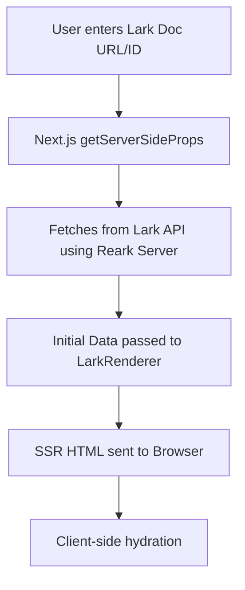

# Next.js Page Router Example (`next-page-router`)

This example demonstrates how to use **AokiApp Reark** to render Lark/Feishu documents with classic Next.js routing (pages directory) and full server-side rendering (SSR). It serves as a reference for integrating [`@aokiapp/reark`](https://github.com/aokiapp/reark) and [`@aokiapp/reark-server`](https://github.com/aokiapp/reark) in a real-world SSR scenario.

---

## Overview

- **Purpose:**  
  Showcases SSR of Lark/Feishu documents using the classic Next.js Page Router (`pages/` directory), providing a clear integration pattern for monorepo users.
- **Use Case:**  
  Ideal for developers who want to embed Lark/Feishu document rendering in their own Next.js (Page Router) apps, with robust SSR and API credential management.

---

## Key Features

- **Server-Side Rendering (SSR):**  
  Fetches and renders Lark/Feishu documents on the server for fast, SEO-friendly delivery.
- **Classic Next.js Routing:**  
  Uses the `pages/` directory for routing, compatible with legacy and current Next.js projects.
- **Lark/Feishu Integration:**  
  Securely fetches document data using your Lark API credentials.
- **Rich Document Rendering:**  
  Supports tables of contents, rich blocks, and asset caching.
- **User Input:**  
  Enter a Lark document URL or ID to view its contents.
- **File Caching:**  
  Downloads and serves document assets from `public/lark-files`.

---

## Setup & Installation

### Prerequisites

- Node.js (v18+ recommended)
- Package manager: `pnpm`, `npm`, `yarn`, or `bun`

### 1. Clone and Install

```bash
cd examples/next-page-router
pnpm install
# or
npm install
# or
yarn install
# or
bun install
```

### 2. Configure Environment Variables

Copy `.env.example` to `.env` and set your Lark API credentials:

```env
LARK_APP_ID=your-app-id
LARK_APP_SECRET=your-app-secret
```

> **Note:** You must obtain these credentials from the [Lark/Feishu developer console](https://open.larksuite.com/).

### 3. Start the Development Server

```bash
pnpm dev
# or
npm run dev
# or
yarn dev
# or
bun dev
```

Open [http://localhost:3000](http://localhost:3000) in your browser.

---

## Usage

1. **Enter a Lark Document URL or ID:**  
   Paste a Lark/Feishu document URL (e.g., `https://aoki-app.jp.larksuite.com/docx/Q5Oqd7WljoQL6Nx4bdVjOASbpue?from=from_copylink`) or just the document ID (e.g., `Q5Oqd7WljoQL6Nx4bdVjOASbpue`) into the input box.
2. **View the Rendered Document:**  
   The app fetches and renders the document using SSR. If the document contains a table of contents, it will be displayed.
3. **Example Input:**
   ```
   https://aoki-app.jp.larksuite.com/docx/Q5Oqd7WljoQL6Nx4bdVjOASbpue?from=from_copylink
   ```
   or
   ```
   Q5Oqd7WljoQL6Nx4bdVjOASbpue
   ```

> **Tip:** You can bookmark URLs with `?documentId=...` for direct access.

---

## SSR, Customization, and Integration

### How SSR Works

- Uses `getServerSideProps` to fetch document data from Lark/Feishu on each request.
- Credentials are securely loaded from environment variables.
- Document assets (images, files) are cached in `public/lark-files` and served statically.

### Customization

- **File Storage:**  
  Change `PUBLIC_DIR` and `PUBLIC_URL_BASE` in `pages/index.tsx` to customize where assets are stored and served.
- **Renderer:**  
  Extend or customize the renderer by modifying the usage of `LarkRenderer` and `TableOfContents` from `@aokiapp/reark`.

### Integration Points

- Integrates with [`@aokiapp/reark`](https://github.com/aokiapp/reark) for React rendering.
- Uses [`@aokiapp/reark-server`](https://github.com/aokiapp/reark) for SSR and API communication.

---

## Visual Flow (SSR)



---

## Troubleshooting & FAQ

### Common Issues

- **Invalid Credentials:**  
  Ensure `LARK_APP_ID` and `LARK_APP_SECRET` are correct and not expired.
- **Document Not Found:**  
  Double-check the document ID or URL. The document must be accessible by your app’s credentials.
- **SSR Errors:**  
  Check your server logs for stack traces. Ensure all dependencies are installed and environment variables are set.

### Where to Get Help

- [Troubleshooting Guide](../../docs/troubleshooting.md)
- [FAQ](../../docs/faq.md)
- [AokiApp Reark Documentation](https://github.com/aokiapp/reark)

---

## Related Documentation

- [Monorepo Example Apps Overview](../../docs/examples.md)
- [Usage Guide](../../docs/guides/usage.md)
- [Advanced Guide](../../docs/guides/advanced.md)
- [@aokiapp/reark API Reference](../../docs/api/core.md)
- [@aokiapp/reark-server API Reference](../../docs/api/server.md)

---

## License

This example is part of the [AokiApp Reark](https://github.com/aokiapp/reark) monorepo and is provided under the MIT License.

---

<!--
Screenshots and additional diagrams can be added here.
-->
