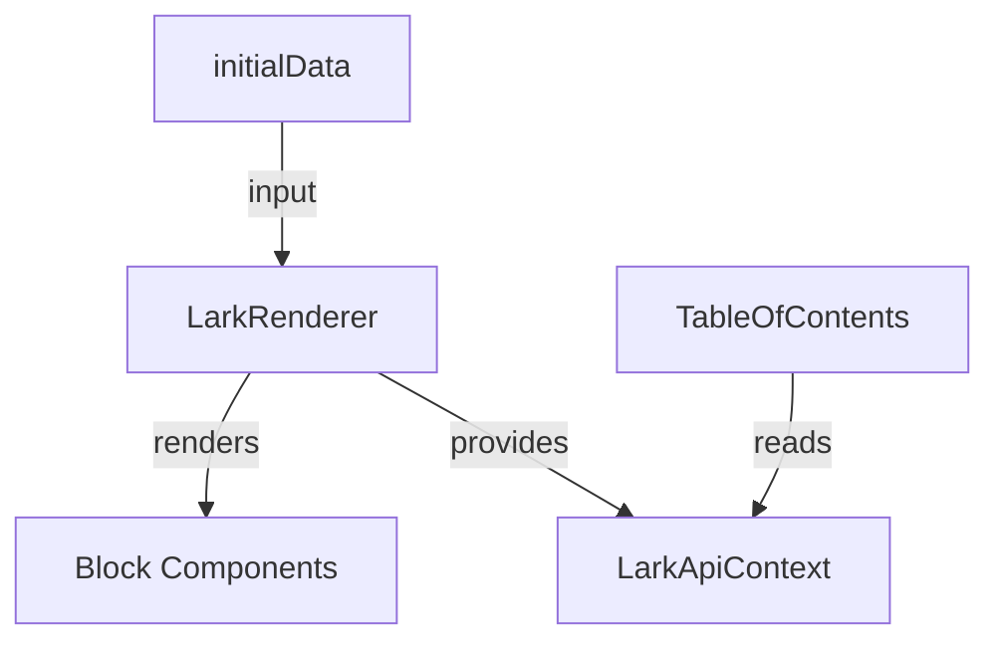

# @aokiapp/reark-renderer

A powerful React renderer for Lark/Notion-style block documents.  
**@aokiapp/reark-renderer** is the core UI engine of the Reark monorepo, providing extensible, themeable, and SSR-friendly components for rendering rich document content.

---

## Features

- **Lark/Notion-style block rendering**: Supports text, headings, tables, images, todos, callouts, code blocks, and more.
- **SSR & Next.js ready**: Seamless integration with server-side rendering frameworks.
- **Customizable & extensible**: Override block rendering, inject custom components, and theme via CSS.
- **Table of Contents**: Built-in component for document navigation.
- **TypeScript support**: Fully typed public API.
- **Visual Regression Testing**: Ensures UI consistency across updates.

---

## Installation

```sh
npm install @aokiapp/reark
# or
yarn add @aokiapp/reark
# or
pnpm add @aokiapp/reark
```

**Peer dependencies:**

- React 18+
- (Optional) [Noto Sans CJK JP](https://fonts.google.com/noto/specimen/Noto+Sans+JP) for Japanese text rendering in tests

---

## Usage

### Basic Example

```tsx
import { LarkRenderer } from "@aokiapp/reark";
import "@aokiapp/reark/style.css";

const initialData = /* Lark/Notion-style document data */;

export default function MyPage() {
  return <LarkRenderer initialData={initialData} />;
}
```

### With Table of Contents

```tsx
import { LarkRenderer, TableOfContents } from "@aokiapp/reark";
import "@aokiapp/reark/style.css";

export default function MyPage({ initialData }) {
  return (
    <div style={{ display: "flex" }}>
      <aside style={{ width: 240 }}>
        <TableOfContents blocks={initialData.blocks} />
      </aside>
      <main style={{ flex: 1 }}>
        <LarkRenderer initialData={initialData} />
      </main>
    </div>
  );
}
```

### Next.js / SSR Integration

See [examples/next-page-router](../../examples/next-page-router) for a full SSR example.

---

## API Reference

### `LarkRenderer`

The main component for rendering Lark/Notion-style documents.

| Prop        | Type                       | Required | Description                      |
| ----------- | -------------------------- | -------- | -------------------------------- |
| initialData | `LarkApiContextValue`      | Yes      | Parsed document data to render   |
| components  | `Record<string, React.FC>` | No       | Custom block/component overrides |
| className   | `string`                   | No       | Custom CSS class for theming     |

**Usage Example:**

```tsx
<LarkRenderer
  initialData={initialData}
  components={{
    Callout: MyCustomCallout,
    // ...override other blocks
  }}
  className="my-theme"
/>
```

**Extension Points:**

- Override any block type by passing a custom component via the `components` prop.
- Style via the `className` prop or by overriding CSS classes.

---

### `TableOfContents`

A component for rendering a table of contents from document blocks.

| Prop   | Type      | Required | Description                            |
| ------ | --------- | -------- | -------------------------------------- |
| blocks | `Block[]` | Yes      | Array of block data (from initialData) |

**Usage Example:**

```tsx
<TableOfContents blocks={initialData.blocks} />
```

---

### `LarkApiContextValue` (Type)

The shape of the data expected by the renderer.

```ts
export type LarkApiContextValue = {
  blocks?: Block[];
  comments?: CommentData[];
  files?: Record<string, string>; // fileToken → public URL
};
```

---

## Supported Block Types

| Block Type     | Component                      | Description                |
| -------------- | ------------------------------ | -------------------------- |
| Text           | `TextBlock`                    | Rich text, links, mentions |
| Heading        | `Heading`                      | H1–H3 headings             |
| Table          | `Table`, `TableCell`           | Tables and cells           |
| Image          | `Image`                        | Inline images              |
| Todo           | `Todo`                         | Checkbox lists             |
| Callout        | `Callout`                      | Highlighted callouts       |
| Code           | `CodeBlock`                    | Syntax-highlighted code    |
| Divider        | `Divider`                      | Horizontal rule            |
| File           | `FileBlock`                    | File attachments           |
| Grid           | `GridBlock`, `GridColumnBlock` | Grid layouts               |
| Iframe         | `IframeBlock`                  | Embedded iframes           |
| Quote          | `QuoteContainer`               | Blockquotes                |
| Ordered List   | `OrderedList`                  | Numbered lists             |
| Unordered List | `UnorderedList`                | Bulleted lists             |
| Page           | `Page`                         | Document root              |
| ViewBlock      | `ViewBlock`                    | File previews              |
| Unsupported    | `UnsupportedBlock`             | Fallback for unknown types |

---

## Advanced Usage

- **Custom Block Rendering:**  
  Pass custom components via the `components` prop to override default rendering for any block type.

- **Theming:**  
  Use the `className` prop or override CSS classes in `@aokiapp/reark/style.css`.

- **SSR Support:**  
  Works seamlessly with Next.js and other SSR frameworks.

---

## Visual Overview



## _The above diagram illustrates the main data flow between the LarkRenderer component, its block components, context, and input data. If you have a real screenshot or more detailed diagram, please contribute it to improve this section._

## Related Documentation

- [Full API Reference](../../docs/api/renderer.md)
- [Example Projects](../../examples/)
- [Guides](../../docs/guides/)

---

## Visual Regression Testing & Japanese Font Requirement

This package uses Visual Regression Testing (VRT) to ensure UI consistency.  
**VRT tests require Japanese fonts (e.g., Noto Sans CJK JP) to be installed on your environment.**  
If Japanese fonts are missing, VRT tests may fail or produce incorrect snapshots, especially for components rendering Japanese text.

### How to Install Japanese Fonts

- **Ubuntu / Debian**
  ```sh
  sudo apt update
  sudo apt install fonts-noto-cjk
  ```
- **CentOS / RHEL**
  ```sh
  sudo yum install google-noto-sans-cjk-fonts
  ```
- **macOS (Homebrew)**
  ```sh
  brew tap homebrew/cask-fonts
  brew install --cask font-noto-sans-cjk
  ```
- **Windows (Chocolatey)**
  ```sh
  choco install noto
  ```
- Or download and install from:  
  https://fonts.google.com/noto/specimen/Noto+Sans+JP

**Notes:**

- Restart your test runner or development server after installing fonts.
- For CI environments, ensure font installation steps are included in your setup.

---

## License

MIT
