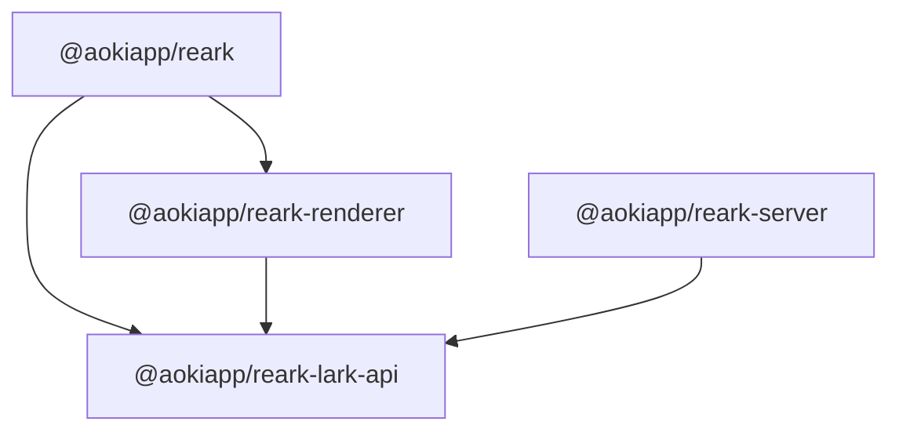

# @aokiapp/reark-server

Backend utilities for SSR, asset management, and data aggregation for Lark (Feishu) documents.

---

## Overview

**@aokiapp/reark-server** is part of the [AokiApp Reark](../../README.md) monorepo, providing server-side tools for rendering and serving Lark documents in modern web frameworks. It is designed for seamless integration with frameworks like Next.js and works in concert with the core, lark-api, and renderer packages.



---

## Key Features

- **SSR Data Aggregation:** Fetch and prepare Lark documents for server-side rendering.
- **Efficient Asset Management:** Download, cache, and serve images/files referenced in Lark documents.
- **Comment Aggregation:** Fetch and include document comments for rendering.
- **Robust Error Handling:** Lenient error handling and manifest management for production reliability.

---

## Installation

```bash
npm install @aokiapp/reark-server
# or
pnpm add @aokiapp/reark-server
# or
yarn add @aokiapp/reark-server
```

**Prerequisites:**

- Node.js v18+ recommended
- Lark (Feishu) API credentials (App ID & App Secret)
- See [monorepo README](../../README.md) for environment setup

---

## Usage

### Basic Example

```ts
import { setCredentials } from "@aokiapp/reark-lark-api";
import { getLarkInitialDataForSSR } from "@aokiapp/reark-server";

setCredentials(process.env.LARK_APP_ID, process.env.LARK_APP_SECRET);

const initialData = await getLarkInitialDataForSSR(
  documentId,
  "public/lark-files",
  "/lark-files/",
);

// Pass initialData to your renderer (e.g., <LarkRenderer initialData={initialData} />)
```

### Integration

- Use in Next.js `getServerSideProps` or API routes for dynamic document rendering.
- Works seamlessly with [@aokiapp/reark](../core/README.md) and [@aokiapp/reark-renderer](../renderer/README.md).
- See [example apps](../../examples/) for full integration patterns.

---

## API Reference

### Exports

- **getLarkInitialDataForSSR(documentId, publicDir, publicUrlBase?)**  
  Fetches and prepares Lark document data for SSR, handling asset storage and URL mapping.

- **LarkInitialData**  
  Interface describing the SSR data structure.

- **setCredentials(appId, appSecret)**  
  Re-exported from `@aokiapp/reark-lark-api` for convenience.

### getLarkInitialDataForSSR

```ts
async function getLarkInitialDataForSSR(
  documentId: string,
  publicDir: string,
  publicUrlBase: string = "/lark-files/",
): Promise<LarkInitialData>;
```

- **documentId**: Lark document ID (string)
- **publicDir**: Directory to store downloaded files (string)
- **publicUrlBase**: Public URL prefix for files (string, default: `/lark-files/`)

**Returns:**  
A Promise resolving to a `LarkInitialData` object:

```ts
interface LarkInitialData {
  version: number;
  blocks: Block[];
  comments: CommentData[];
  files: Record<string, string>; // fileToken → public URL
}
```

- `blocks`: Array of Lark document blocks (see [@aokiapp/reark-lark-api](../lark-api/README.md) for types)
- `comments`: Array of comment data
- `files`: Map of file tokens to public URLs

**Behavior:**

- Downloads and caches files referenced in the document.
- Skips already-downloaded files.
- Handles errors gracefully (logs and continues).
- Fetches comments for the document.

### setCredentials

```ts
function setCredentials(appId: string, appSecret: string): void;
```

Sets Lark API credentials for all subsequent requests.

---

## Development

- `npm run build` – Build the package
- `npm run lint` – Lint source files
- `npm run typecheck` – Type-check code
- `npm run test` – Run tests

See [package.json](./package.json) for all scripts.

---

## Extending & Customization

- To customize file handling or error management, extend or wrap `getLarkInitialDataForSSR`.
- For advanced use cases, refer to the source code and [API reference](../../docs/api/server.md).

---

## Related Documentation

- [API Reference: docs/api/server.md](../../docs/api/server.md)
- [Monorepo README](../../README.md)
- [Example Apps](../../examples/)
- [@aokiapp/reark-lark-api](../lark-api/README.md)
- [@aokiapp/reark-renderer](../renderer/README.md)

---

## License

MIT © AokiApp Contributors
